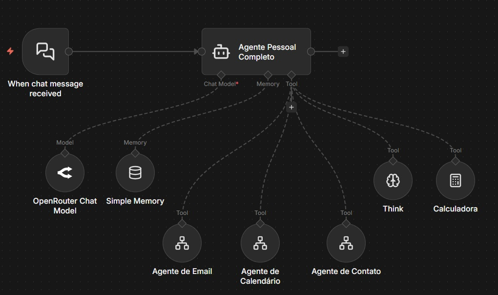
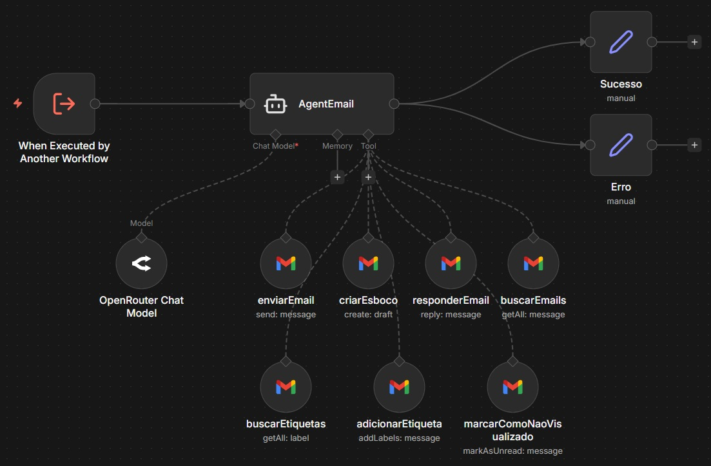
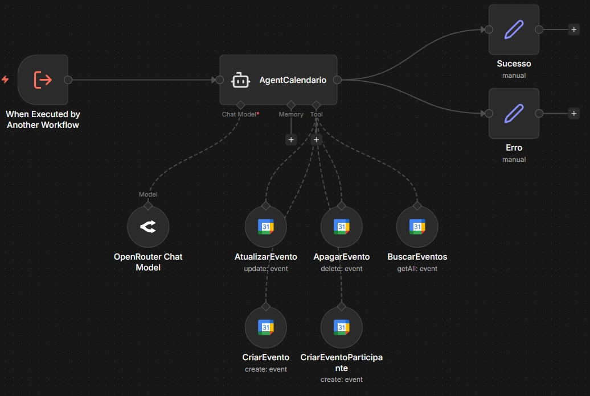
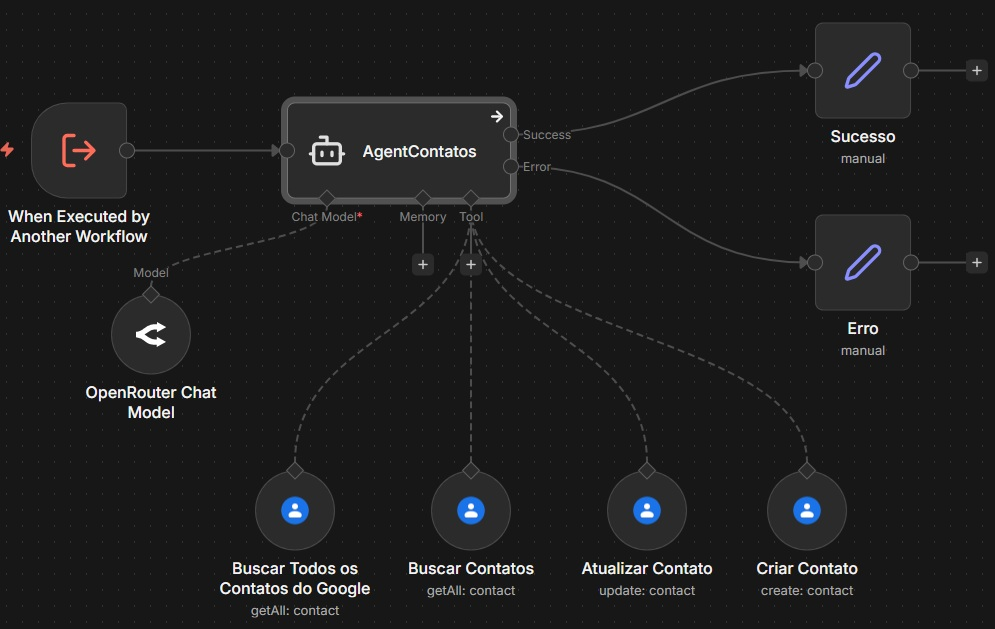

# Assistente Pessoal com IA (n8n)

## 🎯 Contexto do Problema

Profissionais lidam diariamente com múltiplas tarefas administrativas, como **gerenciar e-mails, organizar compromissos e manter contatos atualizados**. Apesar de essenciais, essas atividades consomem tempo e exigem alternância constante entre diferentes ferramentas.

Os principais desafios observados nesse cenário são:

- Alto volume de tarefas manuais e repetitivas
- Falta de centralização entre e-mail, agenda e contatos
- Baixa produtividade operacional
- Dificuldade de escalar automações de forma organizada

O objetivo deste projeto foi desenvolver uma solução capaz de **entender a intenção do usuário** e **executar ações automaticamente**, centralizando tarefas do dia a dia em um único fluxo inteligente.

---

## 💡 Solução Proposta

Foi desenvolvido um **Assistente Pessoal com Inteligência Artificial utilizando o n8n**, estruturado com base em uma **arquitetura de agentes**.

A solução é composta por um **agente orquestrador**, responsável por interpretar a intenção do usuário, e por **agentes especializados**, cada um focado em um domínio específico, como e-mail, calendário e contatos.

Essa abordagem permite:

- Separação clara de responsabilidades  
- Facilidade de manutenção  
- Escalabilidade da solução  
- Inclusão simples de novos agentes no futuro  

---

## 🧠 Arquitetura da Solução

A arquitetura foi desenhada de forma **modular e desacoplada**, seguindo o padrão de **orquestração de agentes**.

### Componentes Principais

- **Chat Trigger (n8n)**
  - Ponto de entrada do sistema
  - Recebe mensagens do usuário

- **Agente Pessoal (Orquestrador)**
  - Analisa a mensagem recebida
  - Interpreta a intenção utilizando um LLM
  - Decide qual agente especializado deve ser acionado

- **LLM (OpenRouter)**
  - Responsável pela interpretação semântica das mensagens
  - Classificação de intenções

- **Simple Memory**
  - Armazena contexto básico da conversa
  - Auxilia o agente em decisões futuras

---

## 🤖 Agentes Especializados

### 📧 Agente de Email

Responsável pela gestão completa da caixa de entrada.

**Principais funções:**
- Buscar emails
- Criar rascunhos de resposta
- Responder emails automaticamente
- Enviar emails
- Gerenciar etiquetas
- Marcar emails como não visualizados

Integração com **Gmail API**.

---

### 📅 Agente de Calendário

Responsável pelo gerenciamento de compromissos e eventos.

**Principais funções:**
- Buscar eventos
- Criar eventos (com ou sem participantes)
- Atualizar eventos existentes
- Apagar eventos

Integração com **Google Calendar API**.

---

### 👤 Agente de Contatos

Responsável pela gestão da base de contatos do usuário.

**Principais funções:**
- Buscar todos os contatos
- Buscar contatos específicos
- Criar novos contatos
- Atualizar informações existentes

Integração com **Google Contacts API**.

---

## 🔄 Fluxo de Funcionamento

1. O usuário envia uma mensagem pelo chat
2. O workflow é iniciado pelo Chat Trigger
3. O Agente Pessoal interpreta a intenção da mensagem
4. O LLM classifica a solicitação
5. O agente orquestrador direciona a tarefa para o agente especializado adequado
6. O agente executa a ação solicitada
7. O resultado é retornado ao usuário

---

## 🛠️ Tecnologias Utilizadas

- n8n
- AI Agent Node
- LLM via OpenRouter
- Simple Memory
- Gmail API
- Google Calendar API
- Google Contacts API

---

## 🚀 Casos de Uso

- Assistente pessoal para profissionais e executivos
- Automação de rotinas administrativas
- Centralização de tarefas operacionais
- Base para integração com WhatsApp ou Telegram
- Suporte a equipes administrativas

---

## 👤 Autor

**Matheus Amaral**  
Projeto desenvolvido como case de portfólio em automação, inteligência artificial e arquitetura de agentes.
